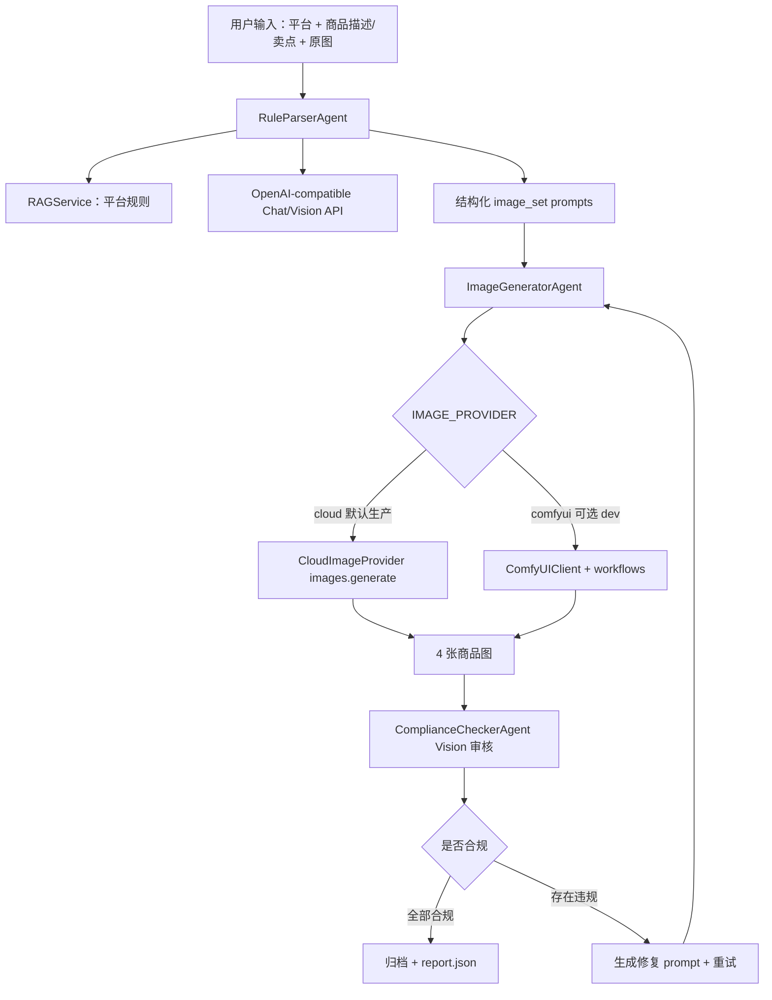

# MeituEcomAgent

> 美图电商智能生图代理服务：基于多智能体协作的跨平台商品图片生成、合规审核、自动修复与归档系统。

## 当前定位

- **生产模式**：默认使用云端 OpenAI-compatible API，不依赖本地 ComfyUI、Ollama 或本地大模型。
- **开发模式**：可通过 `IMAGE_PROVIDER=comfyui` 保留本地 ComfyUI 工作流调试能力。
- **配置方式**：所有密钥和 Provider 选择均从 `.env` / 环境变量读取，统一在 `app/config.py` 管理。

## 架构概览



## 快速开始

### 1. 准备 D 盘虚拟环境

```powershell
cd D:\Trae_work\diansAgent\diansAgent\MeituEcomAgent
py -3.11 -m venv D:\Trae_work\diansAgent\.venvs\meitu-ecom-agent
D:\Trae_work\diansAgent\.venvs\meitu-ecom-agent\Scripts\Activate.ps1
python -m pip install --upgrade pip
python -m pip install -r requirements.txt
```

> 如果要启用本地抠图/ComfyUI dev 模式，再安装：`python -m pip install -r requirements-dev.txt`。

### 2. 配置环境变量

```powershell
Copy-Item .env.example .env
notepad .env
```

生产默认推荐：

```env
OPENAI_BASE_URL=https://api.openai.com/v1
OPENAI_API_KEY=sk-your-key
CHAT_MODEL=gpt-4o-mini
VISION_MODEL=gpt-4o-mini
EMBEDDING_MODEL=text-embedding-3-small
IMAGE_PROVIDER=cloud
IMAGE_MODEL=dall-e-3
ENABLE_LOCAL_PREPROCESSING=false
```

DashScope 示例：

```env
OPENAI_BASE_URL=https://dashscope.aliyuncs.com/compatible-mode/v1
OPENAI_API_KEY=sk-your-dashscope-key
CHAT_MODEL=qwen-plus
VISION_MODEL=qwen-vl-max
EMBEDDING_MODEL=text-embedding-v3
IMAGE_PROVIDER=cloud
```

### 3. 本地启动

```powershell
uvicorn app.main:app --host 0.0.0.0 --port 8000 --reload
```

- Web UI: `http://localhost:8000/ui`
- API Docs: `http://localhost:8000/docs`
- Health: `http://localhost:8000/api/v1/health`

## Docker 部署

生产模式：

```powershell
cd D:\Trae_work\diansAgent\diansAgent\MeituEcomAgent
Copy-Item .env.example .env
docker compose up -d --build
docker compose logs -f api
```

本地 ComfyUI/dev 覆盖模式：

```powershell
docker compose -f docker-compose.yml -f docker-compose.dev.yml up -d --build
```

数据默认落在仓库 D 盘目录：

- `MeituEcomAgent\.data\knowledge_base_index`
- `MeituEcomAgent\.data\u2net`
- `MeituEcomAgent\output`
- `MeituEcomAgent\logs`

## 关键环境变量

| 变量 | 默认值 | 说明 |
| --- | --- | --- |
| `OPENAI_BASE_URL` | `https://api.openai.com/v1` | OpenAI-compatible API 地址 |
| `OPENAI_API_KEY` | 空 | API 密钥，必须通过环境变量注入 |
| `CHAT_MODEL` | `qwen-plus` | 规则解析/修复 prompt 文本模型 |
| `VISION_MODEL` | `qwen-vl-max` | 合规审核视觉模型 |
| `EMBEDDING_MODEL` | `text-embedding-ada-002` | RAG embedding 模型 |
| `IMAGE_PROVIDER` | `cloud` | `cloud` 或 `comfyui` |
| `IMAGE_MODEL` | `dall-e-3` | 云端图片生成模型 |
| `ENABLE_LOCAL_PREPROCESSING` | `false` | 是否启用 rembg 本地抠图 |
| `COMFYUI_SERVER_ADDRESS` | `host.docker.internal:8188` | dev 模式 ComfyUI 地址 |
| `RAG_PERSIST_DIR` | `./knowledge_base_index` | RAG 索引目录 |
| `OUTPUT_DIR` | `./output` | 输出归档目录 |
| `LOG_FILE` | `./logs/app.log` | 日志文件 |

## API 示例

提交完整电商素材任务：

```bash
curl -X POST http://localhost:8000/api/v1/pipeline/ecommerce-assets \
  -F "platform=taobao" \
  -F "selling_points=30ml陶瓷粉底霜|哑光质感|便携包装" \
  -F "product_image=@product.png"
```

查询任务状态：

```bash
curl http://localhost:8000/api/v1/task/{task_id}
```

健康检查：

```bash
curl http://localhost:8000/api/v1/health
```

## 测试

```powershell
python -m pytest tests -q
python -m pytest tests/test_image_provider.py tests/test_provider_selection.py -q
```

当前测试重点：

- 配置加载与云端默认 Provider。
- 云端图片 Provider 不触网保存图片结果。
- ComfyUI 不再作为生产默认依赖。
- schemas、workflow 转换、归档工具基础逻辑。

## GitHub 发布步骤

```powershell
git status --short
git diff --stat
git add .
git commit -m "feat: support cloud image provider deployment"
git remote add origin https://github.com/<owner>/<repo>.git
git push -u origin codex/cloud-deploy-optimization
```

如果远程已存在：

```powershell
git remote -v
git push -u origin codex/cloud-deploy-optimization
```

建议 PR 标题：

```text
feat: cloud-deploy image provider optimization
```

## 项目结构

```text
MeituEcomAgent/
├── app/
│   ├── agents/          # orchestrator, rule_parser, image_generator, compliance_checker
│   ├── services/        # rag, comfyui, image_provider
│   ├── models/          # Pydantic schemas
│   ├── utils/           # file/image helpers
│   ├── static/          # Web UI
│   ├── config.py        # Settings
│   └── main.py          # FastAPI entry
├── workflows/           # ComfyUI dev workflows
├── knowledge_base/      # 平台规则
├── tests/               # 单元测试
├── docker-compose.yml   # 生产云端部署
├── docker-compose.dev.yml
├── Dockerfile
├── requirements.txt
├── requirements-dev.txt
└── .env.example
```
