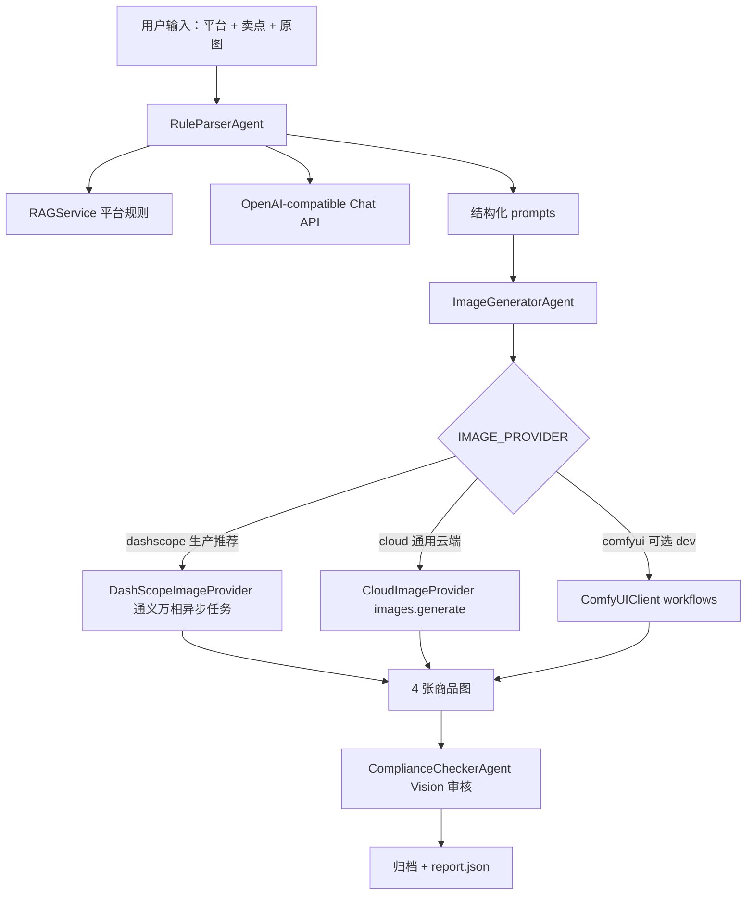

# MeituEcomAgent

美图电商智能生图代理服务：上传商品原图和卖点后，自动解析平台规则、生成电商素材、执行视觉合规审核，并归档交付物。

## 当前定位

- **生产模式**：推荐 `IMAGE_PROVIDER=dashscope`，使用阿里云百炼兼容 API + 通义万相图片生成，不依赖本地大模型、Ollama、ComfyUI。
- **通用云端模式**：可用 `IMAGE_PROVIDER=cloud` 接 OpenAI 或其他 OpenAI-compatible 图片接口。
- **开发模式**：可用 `IMAGE_PROVIDER=comfyui` 保留本地 ComfyUI 工作流调试能力。
- **密钥管理**：所有密钥只通过 `.env` / 环境变量读取，统一由 `app/config.py` 管理。

## 架构概览



## 本地开发

```powershell
cd D:\Trae_work\diansAgent\diansAgent\MeituEcomAgent
py -3.11 -m venv D:\Trae_work\diansAgent\.venvs\meitu-ecom-agent
D:\Trae_work\diansAgent\.venvs\meitu-ecom-agent\Scripts\Activate.ps1
python -m pip install --upgrade pip
python -m pip install -r requirements.txt
Copy-Item .env.example .env
notepad .env
uvicorn app.main:app --host 0.0.0.0 --port 8000 --reload
```

- Web UI: `http://localhost:8000/ui`
- API Docs: `http://localhost:8000/docs`
- Health: `http://localhost:8000/api/v1/health`

## 阿里云百炼 API Key 添加步骤

1. 打开阿里云百炼控制台，进入 **模型服务 / API Key** 页面，创建或复制 API Key。
2. 在项目目录执行 `Copy-Item .env.example .env`。
3. 打开 `.env`，把同一个百炼 Key 填到 `OPENAI_API_KEY` 和 `DASHSCOPE_API_KEY`。
4. 保持 `OPENAI_BASE_URL=https://dashscope.aliyuncs.com/compatible-mode/v1`，用于文本、视觉审核和 embedding。
5. 保持 `IMAGE_PROVIDER=dashscope`，图片生成走百炼通义万相，不依赖本地 ComfyUI。
6. 启动后访问 `http://localhost:8000/api/v1/health`，看到 `image_provider=dashscope:configured` 即配置成功。

推荐 `.env`：

```env
OPENAI_BASE_URL=https://dashscope.aliyuncs.com/compatible-mode/v1
OPENAI_API_KEY=sk-your-dashscope-key
CHAT_MODEL=qwen-plus
VISION_MODEL=qwen-vl-max
EMBEDDING_MODEL=text-embedding-v3

IMAGE_PROVIDER=dashscope
DASHSCOPE_API_KEY=sk-your-dashscope-key
DASHSCOPE_API_BASE=https://dashscope.aliyuncs.com/api/v1
DASHSCOPE_IMAGE_MODEL=wanx2.1-t2i-turbo
DASHSCOPE_IMAGE_SIZE=1280*1280
DASHSCOPE_IMAGE_PROMPT_EXTEND=true
DASHSCOPE_IMAGE_WATERMARK=false
```

## Docker 部署

```powershell
cd D:\Trae_work\diansAgent\diansAgent\MeituEcomAgent
Copy-Item .env.example .env
notepad .env
docker compose up -d --build
docker compose logs -f api
```

本地 ComfyUI 开发模式：

```powershell
docker compose -f docker-compose.yml -f docker-compose.dev.yml up -d --build
```

数据默认落在仓库 D 盘目录内：

- `MeituEcomAgent\.data\knowledge_base_index`
- `MeituEcomAgent\.data\u2net`
- `MeituEcomAgent\output`
- `MeituEcomAgent\logs`

## 关键环境变量

| 变量 | 推荐值 | 说明 |
| --- | --- | --- |
| `OPENAI_BASE_URL` | `https://dashscope.aliyuncs.com/compatible-mode/v1` | Chat/Vision/Embedding 兼容 API 地址 |
| `OPENAI_API_KEY` | 空 | 百炼或其他 OpenAI-compatible Key |
| `CHAT_MODEL` | `qwen-plus` | 规则解析和修复 prompt |
| `VISION_MODEL` | `qwen-vl-max` | 合规视觉审核 |
| `EMBEDDING_MODEL` | `text-embedding-v3` | RAG embedding |
| `IMAGE_PROVIDER` | `dashscope` | `dashscope`、`cloud` 或 `comfyui` |
| `DASHSCOPE_API_KEY` | 空 | 百炼通义万相图片生成 Key |
| `DASHSCOPE_IMAGE_MODEL` | `wanx2.1-t2i-turbo` | 百炼图片模型 |
| `DASHSCOPE_IMAGE_SIZE` | `1280*1280` | 百炼图片尺寸，提高清晰度 |
| `DASHSCOPE_IMAGE_PROMPT_EXTEND` | `true` | 启用百炼 prompt 智能扩写 |
| `DASHSCOPE_IMAGE_WATERMARK` | `false` | 关闭图片水印 |
| `IMAGE_MODEL` | `dall-e-3` | `cloud` provider 使用的图片模型 |
| `ENABLE_LOCAL_PREPROCESSING` | `false` | 是否启用 rembg 本地抠图 |
| `OUTPUT_DIR` | `./output` | 输出归档目录 |
| `LOG_FILE` | `./logs/app.log` | 日志文件 |

## API 示例

```bash
curl -X POST http://localhost:8000/api/v1/pipeline/ecommerce-assets \
  -F "platform=taobao" \
  -F "selling_points=30ml陶瓷粉底霜|哑光质感|便携包装" \
  -F "product_image=@product.png"
```

```bash
curl http://localhost:8000/api/v1/task/{task_id}
curl http://localhost:8000/api/v1/health
```

## 测试

```powershell
python -m pytest tests -q
python -m pytest tests/test_image_provider.py tests/test_provider_selection.py -q
```

## GitHub 发布步骤

```powershell
git status --short
git diff --stat
git add .
git commit -m "feat: add dashscope image provider"
git push -u origin codex/cloud-deploy-optimization
```
