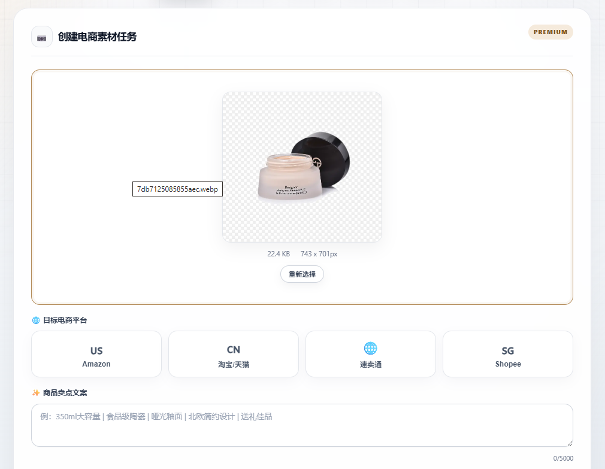
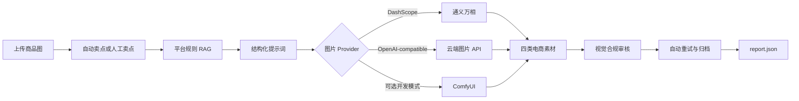

# Dianshna Image / MeituEcomAgent

[](https://github.com/zsj00/Dianshna_image/actions/workflows/ci.yml)

面向 Amazon、淘宝/天猫、AliExpress 和 Shopee 的云端电商图片生成 Agent。上传商品原图后，系统可自动提取商品卖点、解析平台规则、生成四类电商素材、执行视觉合规审核，并归档图片与 JSON 报告。

生产环境不要求本地大模型、Ollama 或 ComfyUI。推荐使用阿里云百炼兼容 API 和通义万相；ComfyUI 仅保留为可选开发模式。

项目代码位于 `MeituEcomAgent/` 目录。

## 界面与效果

### Web 界面

<p align="center">
  
</p>

### 上传原图与生成结果

<table>
  <tr>
    <th>上传原图</th>
    <th>白底主图</th>
    <th>场景营销图</th>
  </tr>
  <tr>
    <td></td>
    <td></td>
    <td></td>
  </tr>
</table>

> 示例图片来自项目实际运行结果。最终质量受原图背景、清晰度、云端模型和提示词影响。

## 核心能力

- 根据商品图片自动生成中文卖点文案。
- 通过 RAG 检索不同平台的图片规范并生成结构化提示词。
- 生成白底主图、场景营销图、细节特写图和尺寸对比图。
- 白底、细节和尺寸素材优先复用上传商品像素，减少商品外观漂移。
- 场景图采用云端背景生成与商品合成，降低对本地生成环境的依赖。
- 使用视觉模型执行合规审核，输出违规项、修改建议和综合评分。
- 不合规素材支持有限次数自动重试；确定性参考素材不会被无意义重绘。
- 保存任务状态、流程日志、图片、结构化报告和归档目录。
- Docker 健康检查、GitHub Actions 测试和生产启动命令已配置。

## 工作流程



## 云端 Provider

| `IMAGE_PROVIDER` | 用途 | 是否需要本地模型 |
| --- | --- | --- |
| `dashscope` | 推荐生产配置，使用阿里云百炼通义万相 | 否 |
| `cloud` | OpenAI 或其他兼容 `images.generate` 的 API | 否 |
| `comfyui` | 本地工作流调试 | 是，仅开发可选 |

文本、视觉审核和 Embedding 统一使用 OpenAI-compatible 配置；所有环境变量由 `app/config.py` 读取，项目中不硬编码密钥。

## Docker 快速启动

### 1. 创建配置

```powershell
Set-Location MeituEcomAgent
Copy-Item .env.example .env
notepad .env
```

使用阿里云百练时，至少填写：

```env
OPENAI_BASE_URL=https://dashscope.aliyuncs.com/compatible-mode/v1
OPENAI_API_KEY=你的百炼_API_Key

IMAGE_PROVIDER=dashscope
DASHSCOPE_API_KEY=你的百炼_API_Key
```

`.env` 已被 Git 忽略，不要将真实 Key 写入 `.env.example`、README 或代码。

### 2. 启动服务

```powershell
docker compose up -d --build
docker compose ps
docker compose logs -f api
```

访问地址：

- Web UI：<http://localhost:8002/ui>
- API 文档：<http://localhost:8002/docs>
- 健康检查：<http://localhost:8002/api/v1/health>

停止服务：

```powershell
docker compose down
```

容器将数据保存在仓库目录下的 `.data/`、`output/` 和 `logs/`，便于统一放在 D 盘。

## 本地开发

建议将虚拟环境和缓存放到 D 盘：

```powershell
Set-Location MeituEcomAgent
py -3.11 -m venv D:\Trae_work\diansAgent\.venvs\meitu-ecom-agent
D:\Trae_work\diansAgent\.venvs\meitu-ecom-agent\Scripts\Activate.ps1
$env:PIP_CACHE_DIR='D:\Trae_work\diansAgent\.cache\pip'
python -m pip install -r requirements-dev.txt
Copy-Item .env.example .env
uvicorn app.main:app --host 0.0.0.0 --port 8000 --reload
```

本地开发地址为 <http://localhost:8000/ui>。

如需调试本地 ComfyUI：

```powershell
docker compose -f docker-compose.yml -f docker-compose.dev.yml up -d --build
```

## 常用环境变量

| 变量 | 推荐值 | 说明 |
| --- | --- | --- |
| `OPENAI_BASE_URL` | 百炼兼容模式地址 | Chat、Vision、Embedding API 地址 |
| `OPENAI_API_KEY` | 留空后自行填写 | 文本与视觉模型密钥 |
| `CHAT_MODEL` | `qwen-plus` | 规则解析与提示词修复 |
| `VISION_MODEL` | `qwen-vl-max` | 商品分析与合规审核 |
| `EMBEDDING_MODEL` | `text-embedding-v3` | 平台规则向量检索 |
| `IMAGE_PROVIDER` | `dashscope` | 图片 Provider 选择 |
| `DASHSCOPE_API_KEY` | 留空后自行填写 | 通义万相密钥 |
| `DASHSCOPE_IMAGE_MODEL` | `wanx2.1-t2i-turbo` | 通义万相模型 |
| `IMAGE_PROVIDER_TIMEOUT` | `300` | 云端图片任务超时秒数 |
| `COMFYUI_ENABLED` | `false` | 是否启用可选本地模式 |
| `ENABLE_LOCAL_PREPROCESSING` | `false` | 是否启用可选本地预处理 |

完整配置见 [`MeituEcomAgent/.env.example`](MeituEcomAgent/.env.example)。

## API

| 方法 | 路径 | 说明 |
| --- | --- | --- |
| `GET` | `/api/v1/health` | 服务、知识库和 Provider 健康状态 |
| `POST` | `/api/v1/selling-points/from-image` | 根据商品图片生成卖点 |
| `POST` | `/api/v1/pipeline/ecommerce-assets` | 创建完整电商素材任务 |
| `GET` | `/api/v1/task/{task_id}` | 查询任务状态和结果 |

创建任务示例：

```bash
curl -X POST http://localhost:8002/api/v1/pipeline/ecommerce-assets \
  -F "platform=taobao" \
  -F "selling_points=哑光质感｜便携包装｜适合日常使用" \
  -F "max_retries=3" \
  -F "product_image=@product.png"
```

支持上传 PNG、JPEG 和 WebP，单文件最大 20 MB。

## 输出目录

```text
output/
├── uploads/                         # 上传原图和处理中间素材
├── {task_id}/                       # 当前任务图片与 report.json
└── {platform}/{product}_{timestamp}/# 按平台和商品归档
```

报告包含每张图片的合规状态、评分、违规项、修改建议、重试次数和完整流程日志。

## 项目结构

```text
app/
├── agents/          # 规则解析、图片生成、审核与流程编排
├── models/          # Pydantic 请求和响应模型
├── services/        # 图片 Provider、RAG、可选 ComfyUI 客户端
├── static/          # 白色高级版 Web UI
├── utils/           # 图片处理、商品卡片和文件归档
├── config.py        # 统一环境变量配置
└── main.py          # FastAPI 入口
knowledge_base/      # 电商平台图片规则
tests/               # 配置、Provider 和主流程测试
workflows/           # 可选 ComfyUI 工作流
docs/                # 架构决策与 README 图片
```

云端图片 Provider 的设计取舍见 [`MeituEcomAgent/docs/decisions/ADR-001-cloud-image-provider.md`](MeituEcomAgent/docs/decisions/ADR-001-cloud-image-provider.md)。

## 测试

```powershell
python -m pytest tests -q
python -m tests.verify_deliverables
```

GitHub Actions 会在 `main`、`master` 和 `codex/**` 分支推送时执行测试。

## 已知限制

- 普通实拍图的自动抠图依赖主体与背景差异；复杂背景、遮挡或相近颜色可能残留背景。
- 云端图片模型可能改变背景细节，商品一致性主要通过上传原图锁定素材和后处理保障。
- 当前任务状态保存在进程内存中；容器重启后旧任务状态不会恢复，但已归档文件仍保留在 `output/`。
- 尺寸信息不应由模型猜测；需要真实尺寸时，应由卖家提供并在业务层校验。

## 安全说明

- 真实 API Key 只写入 `.env` 或部署平台的环境变量。
- `.env`、输出目录、日志、缓存和虚拟环境均在 `.gitignore` 中排除。
- 上传前建议执行密钥扫描，并检查 `git diff --staged`。
